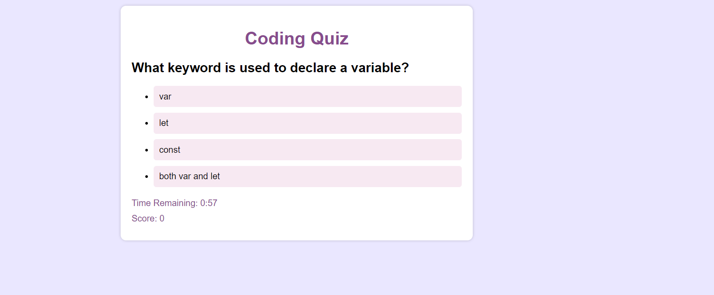

# Magnificent-Coding-Quiz
This is a timed quiz application that tests your knowledge of JavaScript fundamentals. You will be presented with a series of multiple-choice questions and you need to select the correct answer within the given time limit. After completing the quiz, you can save your initials and score to compare with your peers.

Table of Contents
Features
Screenshot
Getting Started
Usage
Customization
Contributing
License
Features
Multiple-choice questions on JavaScript fundamentals.
Timed quiz with countdown timer.
Display of current score during the quiz.
Saving initials and score at the end of the quiz.
User-friendly interface with colorful styling.
Screenshot

Getting Started
To use the JavaScript quiz application locally, follow these steps:

Clone the repository:

shell
Copy code
git clone https://github.com/your-username/javascript-quiz.git
Navigate to the project directory:

shell
Copy code
cd javascript-quiz
Open the index.html file in your web browser.

Usage
Click the "Start" button to begin the quiz.
Read each question carefully and select your answer from the provided choices.
If your answer is correct, you will earn a point. Otherwise, time will be deducted from the countdown timer.
The next question will automatically appear after you have answered the current question.
Repeat steps 2-4 until you have answered all the questions or the timer reaches zero.
At the end of the quiz, you can enter your initials and click the "Save Score" button to save your score.
You can view your score and compare it with your peers.
Customization
You can customize the quiz by modifying the following aspects:

Questions: You can add or modify the questions in the questions array in the script.js file. Each question object should have a question, choices, and correctAnswer property.

Styling: You can customize the CSS styles by modifying the styles.css file. Feel free to change the colors, fonts, spacing, or any other visual aspect to match your preferences.

Timer Duration: You can change the timer duration by modifying the timeRemaining variable in the script.js file. By default, the timer is set to 60 seconds.

Contributing
Contributions to the JavaScript quiz application are always welcome! If you find any bugs, have suggestions for improvements, or want to add new features, please open an issue or submit a pull request.

License
The JavaScript quiz application is licensed under the MIT License.

